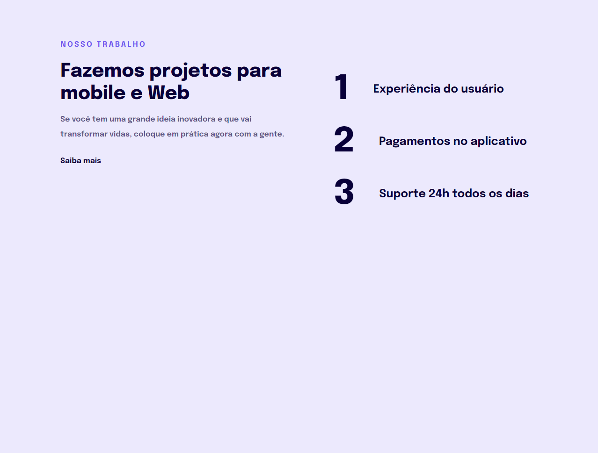

# Explorer Stage 3- Projeto 2

> Programa Explorer - Rocketseat

Projeto sobre responsividade construído no programa Explorer da Rocketseat, a largura responsiva usada neste foi a partir de 700px

[📌Clique aqui para acessar](https://axelselbach.github.io/Desafio-02-Stage03-Explorer-Rocketseat/)

## 📌 Tecnologias usadas
- HTML
- CSS

## 📌 Contato

axelselbach90@gmail.com
